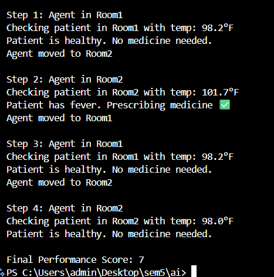

<h1>ExpNo 1 :Developing AI Agent with PEAS Description</h1>
<h3>Name: Bharath Raj P</h3>
<h3>Register Number: 212223230031</h3>


<h3>AIM:</h3>
<br>
<p>To find the PEAS description for the given AI problem and develop an AI agent.</p>
<br>
<h3>Theory</h3>
<h3>Medicine prescribing agent:</h3>
<p>Such this agent prescribes medicine for fever (greater than 98.5 degrees) which we consider here as unhealthy, by the user temperature input, and another environment is rooms in the hospital (two rooms). This agent has to consider two factors one is room location and an unhealthy patient in a random room, the agent has to move from one room to another to check and treat the unhealthy person. The performance of the agent is calculated by incrementing performance and each time after treating in one room again it has to check another room so that the movement causes the agent to reduce its performance. Hence, agents prescribe medicine to unhealthy.</p>
<hr>
<h3>PEAS DESCRIPTION:</h3>
<table>
  <tr>
    <td><strong>Agent Type</strong></td>
    <td><strong>Performance</strong></td>
     <td><strong>Environment</strong></td>
    <td><strong>Actuators</strong></td>
    <td><strong>Sensors</strong></td>
  </tr>
    <tr>
    <td><strong>Medicine prescribing agent</strong></td>
    <td><strong>Treating unhealthy, agent movement</strong></td>
     <td><strong>Rooms, Patient</strong></td>
    <td><strong>Medicine, Treatment</strong></td>
    <td><strong>Location, Temperature of patient</strong></td>
  </tr>
</table>
<hr>
<H3>DESIGN STEPS</H3>
<h3>STEP 1:Identifying the input:</h3>
<p>Temperature from patients, Location.</p>
<h3>STEP 2:Identifying the output:</h3>
<p>Prescribe medicine if the patient in a random has a fever.</p>
<h3>STEP 3:Developing the PEAS description:</h3>
<p>PEAS description is developed by the performance, environment, actuators, and sensors in an agent.</p>
<h3>STEP 4:Implementing the AI agent:</h3>
<p>Treat unhealthy patients in each room. And check for the unhealthy patients in random room</p>
<h3>STEP 5:</h3>
<p>Measure the performance parameters: For each treatment performance incremented, for each movement performance decremented</p>

# Program:
```
import random

class MedicinePrescribingAgent:
    def __init__(self):
        self.rooms = {"Room1": random.uniform(97, 102), 
                      "Room2": random.uniform(97, 102)}  
        self.location = "Room1"
        self.performance = 0

    def move(self):
        self.location = "Room2" if self.location == "Room1" else "Room1"
        self.performance -= 1
        print(f"Agent moved to {self.location}")

    def check_and_treat(self):
        temp = self.rooms[self.location]
        print(f"Checking patient in {self.location} with temp: {temp:.1f}°F")

        if temp > 98.5:
            print("Patient has fever. Prescribing medicine ✅")
            self.performance += 10
            self.rooms[self.location] = 98.0  
        else:
            print("Patient is healthy. No medicine needed.")

    def run(self, steps=4):
        for i in range(steps):
            print(f"\nStep {i+1}: Agent in {self.location}")
            self.check_and_treat()
            if i < steps - 1:
                self.move()
        print(f"\nFinal Performance Score: {self.performance}")

agent = MedicinePrescribingAgent()
agent.run()

```
# Output:


# Result:
Thus the PEAS description for the given AI problem is found and an AI agent is developed.